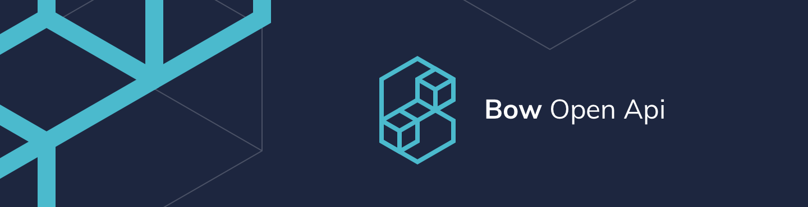

<p align="center">


<a href="https://github.com/bow-swift/nef">

</a>

<a href="https://gitter.im/bowswift/bow">

</a>


</p>

**Bow OpenAPI** is a command-line tool to generate a Swift network client from an OpenAPI / Swagger specification file. Please, refer to the [project website](https://openapi.bow-swift.io) for extensive and detailed documentation about the project.

### Features

💡 [Automatic generation](https://openapi.bow-swift.io/docs/generation-examples/basic-generation/) of network clients written in Swift from an OpenAPI / Swagger specification file, in YAML or JSON formats.

📦 Provision of a [Swift Package](https://openapi.bow-swift.io/docs/consuming-generated-code/adding-the-module-to-your-project/) that can be consumed from Swift Package Manager.

🔨 [Integration with Xcode](https://openapi.bow-swift.io/docs/quick-start/integration-in-xcode/) as a build phase to always keep your code in sync with your specification.

💥 Usage of [Environmental Effects](https://openapi.bow-swift.io/docs/consuming-generated-code/running-a-network-request/) from [Bow](https://bow-swift.io) to suspend side-effects, and improve their composition and testability.

✅ [Enhanced test support](https://openapi.bow-swift.io/docs/consuming-generated-code/testing-your-network-calls/) for integration or end-to-end test with no mocks.

&nbsp;

## Installation guide

Bow OpenAPI is compatible with Unix systems.

### 💻 OS X users

You can [install Bow OpenAPI](https://openapi.bow-swift.io/docs/quick-start/installation-guide/) using [Homebrew](https://brew.sh/index_es). Its formula is not still in the main repository; therefore, you need to tap it first, before installing it:

```bash
brew tap bow-swift/bow
brew install bow-openapi
```

### 🐧 Linux users

```bash
curl -s https://api.github.com/repos/bow-swift/bow-openapi/releases/latest \
 | grep -oP '"tag_name": "\K(.*)(?=")' \
 | xargs -I {} wget -O - https://github.com/bow-swift/bow-openapi/archive/{}.tar.gz \
 | tar xz \
 && sudo make linux -C bow-openapi-*
```

> It will install the last stable version.

Bow OpenAPI depends on `Java 8+` and `swagger-codegen`; both will be installed from `Makefile`. After the installation, you can type `bow-openapi -h` in a new termintal to check it.

## ⚙️ Usage

You can [invoke the tool](https://openapi.bow-swift.io/docs/quick-start/how-to-run-bow-openapi/) with the following parameters:

```bash
bow-openapi --name <NAME> --schema <YAML | JSON> --output <FOLDER>
```

- `name` is the name for the generated module in the resulting Swift Package. You will have to import it in your code using `import <NAME>`.
- `schema` is the path to the OpenAPI / Swagger specification file. It accepts both YAML or JSON formats.
- `output` is the folder where the result will be saved.

## ❤️ Contributing to the project

We welcome your contributions! Help us make Bow OpenAPI better:

🐛 File an issue if you find a bug.

🆕 Suggest a new feature for Bow OpenAPI.

➡️ Open a Pull Request fixing a problem or adding new functionality.

💬 Discuss with us in our [Gitter channel](https://gitter.im/bowswift/bow) to help us shape the future of Bow OpenAPI.

# ⚖️ License

    Copyright (C) 2020 The Bow Authors

    Licensed under the Apache License, Version 2.0 (the "License");
    you may not use this file except in compliance with the License.
    You may obtain a copy of the License at

       http://www.apache.org/licenses/LICENSE-2.0

    Unless required by applicable law or agreed to in writing, software
    distributed under the License is distributed on an "AS IS" BASIS,
    WITHOUT WARRANTIES OR CONDITIONS OF ANY KIND, either express or implied.
    See the License for the specific language governing permissions and
    limitations under the License.
